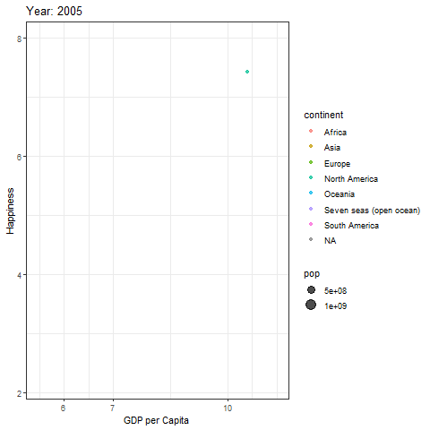

```{r setup, include=FALSE}
knitr::opts_chunk$set(
	echo = FALSE,
	message = FALSE,
	warning = FALSE,
	cache = TRUE
)
```


```{r settings, include=FALSE}
#install needed packages
if (!require("pacman")) install.packages("pacman")

pacman::p_load(
               "ggplot2",
               "tidyverse",
               "dplyr",
               "CGPfunctions",
               "rnaturalearth",
               "sf",
               "ggrepel",
               "ggthemes",
               "gridExtra",
               "cowplot",
               "ggforce",
               "GGally",
               "Rmisc",
               "grid",
               "viridis",
               "RColorBrewer",
               "gganimate",
               "gifski",
               "wbstats",
               "directlabels",
               "gapminder"
               
)


Sys.setlocale("LC_TIME", "English")

# Set Working directory

setwd(dirname(rstudioapi::getSourceEditorContext()$path))

#Upload Dataset

data <- read.csv("data/DataForTable2.1.csv")
nrow(data)

# Getting additional stats for countries
my_indicators <- c(
  life_exp = "SP.DYN.LE00.IN", 
  gdp_capita ="NY.GDP.PCAP.CD", 
  pop = "SP.POP.TOTL"
)
world_stats <- wb_data(my_indicators, start_date = min(data$year), end_date = max(data$year)) #wb_bank getting dataset from dataset

# Inspecting dataframe
data <- data[complete.cases(data),]  #only complete dataset

#drop the below columns
data$Negative.affect<-NULL
data$Positive.affect<-NULL
data$Confidence.in.national.government<-NULL

names(data)

#Rename Columns

names(data)<-c("Country", 
               "Year", 
               "HappinessScore",
               "GDPPer",
               "SocialSupport",
               "LifeExpectancy",
               "Freedom",
               "Generosity",
               "Corruption")

# Add missing years
countries <- unique(data$Country)
years <- unique(data$Year)
all <- data.frame(expand.grid(countries,years))
names(all) <- c("Country", "Year")
data <- left_join(all,data, by = c("Country"="Country", "Year" = "Year"))

data <- left_join(data,world_stats, by = c("Country"="country", "Year" = "date"))

world <- ne_countries(scale = "medium", returnclass = "sf")

data <- left_join(data, world[c("name","economy","continent", "subregion")], by = c("Country"="name"))
```

## Happiness Around the World

```{r Map World, echo=FALSE}
# filter to 2021
data_2021 <- data %>% 
  mutate(HappinessScore = round(HappinessScore,2)) %>% 
  filter(Year == 2021)

# join spacial data with dataset
data_world <- full_join(data_2021, world, by = c("Country"="name","economy","continent", "subregion","geometry"))

# create base world plot
theme_set(theme_bw())

gworld_base <- 
  ggplot(data = data_world) +
  coord_sf(expand = FALSE) +
  geom_sf(aes(geometry =  geometry, fill =  HappinessScore)) +
  scale_fill_gradient(low="red", high="green",na.value = "grey") 

# World Plot  
gworld <- 
  gworld_base +
  theme(legend.position = 'bottom',
        plot.title = element_text(size = 20, hjust = 0.5)) +
  labs(title = "Happiness Worldwide in 2021",
       caption = "Own creation. Data: World Happiness Report, World Bank")

gworld
```

## Happiness in Europe

```{r Map Europe, echo=FALSE}
# Use world base plot for subplot
gworld_sub <- 
  gworld_base +
  geom_rect(xmin = -30, xmax = 50, ymin = 35, ymax = 70, 
            fill = NA, colour = "black", size = 1.5) +
  theme(legend.position= 'none',
        axis.text = element_blank(),
        axis.ticks=element_blank(),
  )

# create plot for Europe
geurope <- ggplot(data = data_world) +
  # geom_sf(aes(fill = income_grp)) +
  coord_sf(expand = FALSE) +
  geom_sf(aes(geometry =  geometry, fill =  HappinessScore)) +
  annotate(geom = "text", x = 19, y = 52, label = "Poland", 
           fontface = "italic", color = "black", size = 4) +
  scale_fill_gradient(low="red", high="green",na.value = "grey") +
  coord_sf(xlim = c(-30, 50), ylim = c(35, 70), expand = TRUE) +
  theme(legend.position = 'bottom',
        plot.title = element_text(size = 20, hjust = 0.5)) +
  labs(title = "Happiness Europe in 2021",
       caption = "Own creation. Data: World Happiness Report, World Bank")

# geurope
# generate plot 
ggdraw() +
  draw_plot(geurope,
            0, 0, 1, 1) +
  draw_plot(gworld_sub, 
            0.03, 0.25, 0.2, 0.2)
```

## Change of Happiness Ranking

```{r Happiness Ranking, echo=FALSE}
european_union <- c("Austria","Belgium","Bulgaria","Croatia","Cyprus",
                    "Czech Rep.","Denmark","Estonia","Finland","France",
                    "Germany","Greece","Hungary","Ireland","Italy","Latvia",
                    "Lithuania","Luxembourg","Malta","Netherlands","Poland",
                    "Portugal","Romania","Slovakia","Slovenia","Spain",
                    "Sweden","United Kingdom")


european_union_data <- 
                      data %>% 
                      filter(Country %in% european_union)

european_union_data_top10 <- european_union_data %>% 
                            group_by(Country) %>%
                            summarise_all(mean) %>%
                            arrange(desc(HappinessScore)) %>% 
                            head(10)


european_union_data_top10_PL <- european_union_data %>% 
                                filter(Country %in% c(european_union_data_top10$Country , "Poland")) %>% 
                                filter(Year> 2009) %>% 
                                filter(Year< 2020)
# option1

ggplot(data = european_union_data_top10_PL, aes(x = Year, y = round(HappinessScore,2), group = Country)) +
  geom_line(aes(color = Country, alpha = 1), size = 2) +
  geom_point(aes(color = Country, alpha = 1), size = 2.3,shape = 21) +
  #geom_text(data = european_union_data_top10_PL %>% filter(Year == "2019", HappinessScore <= max(european_union_data_top10_PL$HappinessScore)),aes(label = Country, x = Year) , hjust = -.1, color = "#888888") + 
  geom_text_repel(data = european_union_data_top10_PL %>% filter(Year == "2019", HappinessScore <= max(european_union_data_top10_PL$HappinessScore)),aes(label = Country), size = 3,hjust = "right",direction = "x") +
  #geom_text(data = european_union_data_top10_PL %>% filter(Year == "2010", HappinessScore <= max(european_union_data_top10_PL$HappinessScore)),aes(label = Country, x = Year) , hjust = 1.05, color = "#888888", size = 4) +
  geom_text_repel(data = european_union_data_top10_PL %>% filter(Year == "2010", HappinessScore <= max(european_union_data_top10_PL$HappinessScore)),aes(label = Country), size = 3,hjust = "left",direction = "x") +
  scale_x_continuous(name = "Year",breaks = seq(2010,2019,by=1),expand = c(.2, .2)) + #c(.26, .4)
  scale_y_reverse(breaks = seq(5,8,by=0.1), name = "Happiness score" ) +
  labs(title = "Top 10 European Union Countries & Poland Happiness score", x = "Year", y = "Score",
       caption = "Own creation. Data: World Happiness Report, World Bank") +
  theme(panel.grid.major = element_blank(),
        panel.grid.minor = element_blank(),
        axis.ticks = element_blank(),
        legend.position = "none")
``` 

## Option 2 

```{r Happiness Ranking 2, echo=FALSE} 
# option 2

data1 <- european_union_data_top10_PL
data1$Year <- as.character(data1$Year)
data1$HappinessScore <- round(data1$HappinessScore,2)


newggslopegraph(data1, Year, HappinessScore, Country,
                Title = "Top 10 Europena Union & Poland Happiness score",
                SubTitle = "2010-2019",
                Caption = "Own creation. Data: World Happiness Report, World Bank",
                DataLabelPadding = 0.2,
                DataLabelLineSize = 0.5,
                #ReverseYAxis = TRUE,
                #ReverseXAxis = TRUE,
                DataLabelFillColor = "lightblue")
```

## Scatter plot

```{r Scatter plot, echo=FALSE}
data_Scatter <- data %>%  
        mutate(PolandFlag = ifelse(Country == "Poland", "Poland", "Top 10"))

g1 <- ggplot(data_Scatter,aes(x = GDPPer, y = HappinessScore,color = PolandFlag)) + 
  geom_point(color = "#adaaaa")+
  geom_smooth(alpha = 0.2) +
  geom_rect(xmin = 9.977814, xmax = 10.4364, ymin = 5.646205, ymax = 6.242094, 
            fill = NA, colour = "red", size = 1)+
  scale_y_continuous(breaks = seq(0, 8, by = 0.5))+
  scale_x_continuous(breaks = seq(0, 12, by = 0.5),
                     labels = paste0('$', 
                                     seq(0, 12, by = 0.5)))+
  labs(title = '',
       x = 'GDP Per capita' , y = 'HappinessScore')

g2 <- ggplot(data_Scatter,aes(x = SocialSupport, y = HappinessScore,color = PolandFlag)) + 
  geom_point(color = "#adaaaa") +
  geom_rect(xmin = 0.8634442, xmax = 0.9550653, ymin = 5.646205, ymax = 6.242094, 
            fill = NA, colour = "red", size = 1)+
  geom_smooth()+
  scale_y_continuous(breaks = seq(0, 8, by = 0.5))+
  scale_x_continuous(breaks = seq(0, 1, by = 0.1))+
  labs(title = '',
       x = 'Social Support' , y = 'HappinessScore')

g3 <- ggplot(data_Scatter,aes(x = LifeExpectancy, y = HappinessScore,color = PolandFlag)) + 
  geom_point(color = "#adaaaa") +
  geom_smooth()+
  geom_rect(xmin = 66.56, xmax = 69.05, ymin = 5.646205, ymax = 6.242094, 
            fill = NA, colour = "red", size = 1)+
  scale_y_continuous(breaks = seq(0, 8, by = 0.5))+
  scale_x_continuous(breaks = seq(10, 70, by = 10))+
  labs(title = '',
       x = 'Life Expectancy' , y = 'HappinessScore')

g4 <- ggplot(data_Scatter,aes(x = Freedom, y = HappinessScore,color = PolandFlag)) + 
  geom_point(color = "#adaaaa")+
  geom_smooth()+
  geom_rect(xmin = 0.7318056, xmax = 0.8828858, ymin = 5.646205, ymax = 6.242094, 
            fill = NA, colour = "red", size = 1)+
  scale_y_continuous(breaks = seq(0, 8, by = 0.5))+
  scale_x_continuous(breaks = seq(0, 1, by = 0.1))+
  labs(title = '',
       x = 'Freedom' , y = 'HappinessScore')


g4 <- g4 + theme(legend.position = "bottom") # position the legend in the desired way
legend <- get_legend(g4) # extract legend from the object
# legend

# title formatting
title <- textGrob("Correlation of Happiness Score",
                  gp = gpar(fontsize = 15, # font size
                            fontface = 2) # bold type
)
# footer formatting
source1 <- textGrob("Source: https://rpubs.com/neilfws/91339",
                    hjust = 0, # text alignment
                    x = .68, y = 0.5, # footer positioning inside the section
                    gp = gpar(fontsize = 10, # font size
                              fontface = 3 # bold type
                    ) 
) 


grid.arrange(arrangeGrob(g1 + theme(legend.position = "none"), 
                         g2 + theme(legend.position = "none"), 
                         g3 + theme(legend.position = "none"), 
                         g4 + theme(legend.position = "none"), 
                         ncol = 2), 
             legend, 
             nrow = 2, 
             top = title,  
             heights = c(10, 1) 
) 
```

## Happiness and GDP

```{r Bubble plot, include=FALSE}
# Set focus countries
focus <- c("Poland", "Germany", "Ukraine", "Romania", "Bulgaria")

# search for countries with biggest difference in score
# inspect <- data_bubble[c("Country", 
#                          "Year", 
#                          "HappinessScore",
#                          "GDPPer",
#                          "SocialSupport",
#                          "LifeExpectancy",
#                          "Freedom",
#                          "Generosity",
#                          "Corruption")] %>% 
#   filter(Country %in% focus) %>%
#   group_by(Country) %>%
#   summarise_at(vars(HappinessScore),
#                list(min = min, max=max)) %>%
#   mutate(diff = max-min) %>%
#   arrange(diff) %>%
#     ungroup()

# focus <- unique(data$Country)

# set up dataframe
data_bubble <- data %>% 
  filter(!is.na(data$HappinessScore) & Year > 2010 & continent == "Europe") %>%
  mutate(mask= case_when(Country %in% focus ~ Country))
  

# produce animation
bubble <- ggplot(data_bubble, aes(gdp_capita, HappinessScore, size = pop, color = mask)) +
  geom_point(data = subset(data_bubble, !is.na(mask)),
             aes(gdp_capita, HappinessScore, size = pop, color = mask),
             alpha = 0.8,show.legend = FALSE) + # Points in Focus
  geom_point(data = subset(data_bubble, is.na(mask)),
             aes(gdp_capita, HappinessScore, size = pop, color = mask),
             alpha = 0.8,show.legend = FALSE) + # Points without Focus
  scale_size(range = c(2, 12)) +
  scale_x_log10() +
  theme(plot.title = element_text(size = 20, hjust = 0.5)) +
  labs(title = 'Happiness vs. GDP per Capita Over Time in {round(frame_time,0)}', 
       x = 'GDP per capita', y = 'Happiness',
       caption = "Own creation. Data: World Happiness Report, World Bank") +
  geom_text(data = subset(data_bubble, Country %in% focus), aes(label = Country), size = 2, color="black") +
  # gganimate specific:
  labs(title = 'Year: {frame_time}', x = 'GDP per Capita', y = 'Happiness') +
  transition_time(as.integer(Year)) +
  ease_aes('linear') +
  shadow_wake(1, alpha = 0.2, exclude_layer = 2:3, size = 1, wrap = FALSE) # no wake for non focus countries and text

# Save as gif:
gif <- animate(bubble,renderer = gifski_renderer(), end_pause=100, nframes = 200)
anim_save("BubbleChart.gif",animation=gif) 
```



## Happiness and COVID

```{r line plot, echo=FALSE}
data_line <- data %>%
  group_by(Year, continent) %>%
  summarise_at(vars(HappinessScore),
               list(HappinessScore = mean), na.rm = TRUE) %>%
  # summarize_at(HappinessScore = mean(HappinessScore,na.rm = TRUE)) %>%
  ungroup()

data_line2 <- data %>%
  group_by(Year) %>%
  summarise_at(vars(HappinessScore),
               list(HappinessScore = mean), na.rm = TRUE) %>%
  ungroup()

data_line2 <- data_line2 %>% add_column("Country"="World")

names(data_line) <- c("Year",
                      "Country",
                      "HappinessScore")

data_line <- union_all(data_line, data_line2)
data_line <- union_all(data_line, filter(data[c("Year", "Country","HappinessScore")], Country == "Poland"))

ggplot(filter(data_line, Country %in% c("World","Europe","Poland") & Year >= 2010),aes(Year,HappinessScore, group = Country, color = Country)) +
  geom_rect(aes(xmin = 2019, ymin = -Inf,
                xmax = Inf, ymax = Inf),
            alpha = .4, fill = "grey", color = NA
  ) +
  geom_line(size = 1.2) +
  geom_point() +
  geom_vline(xintercept = 2019,color = "black", size = 2) +
  geom_dl(aes(label = Country), method = list(dl.combine("last.points"), vjust = 1, hjust=0.5, cex = 1)) +
  annotate("text", x = 2019, y = 7, label = "COVID-19", vjust = 2, hjust=-0.1, size = 5) +
  theme(legend.position = 'bottom',
        plot.title = element_text(size = 20, hjust = 0.5)) +
  labs(color = NULL,
       title = "Happiness Under COVID-19",
       caption = "Own creation. Data: World Happiness Report, World Bank") +
  scale_color_manual(values = c('#003399', '#D22630', 'black')) 
```

## Happiness Distribution by Continent

```{r Boxplot, echo=FALSE}
ggplot(data = filter(data, !is.na(data$continent)),
       aes(y = HappinessScore, x = continent)) +
  geom_boxplot() +
  stat_summary(geom = 'point', shape = 15, fun = mean, size = 2) + 
  labs(title = "Happiness Compared by Country",
       x = "",
       caption = "Own creation. Data: World Happiness Report, World Bank") + 
  theme(legend.position = 'bottom',
        plot.title = element_text(size = 20, hjust = 0.5)) 
```